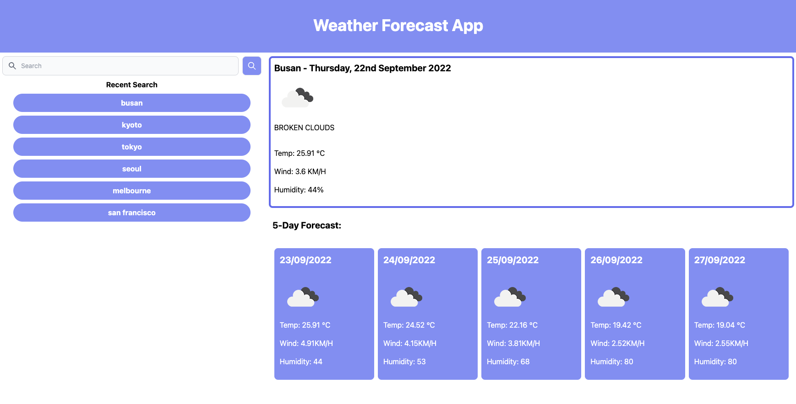

# Weather Forecasting

## Description

This app will help you in figuring out the weather forecast for a specific city. You can see the weather, temperature, wind speed and humidity. It even gives a forecast up to 5 days in the future with the same information as today's forecast. This project is built to help people "travel" around the world and see what the weather conditions are there. It also gives a record of which cities you have "visited" and keep track of them up to 6 most recent locations.

I have learned how to utilise tailwind, jQuery and openweather API. Merging those skills to create a seamless UI and user experience in this app.

## Installation

- Clone the github repo to my local computer
- Create the relevant html and js file
- Start drafting the UI in HTML using tailwind
- Develop logic for search bar
- Develop logic to store the recent search into browser local storage
- Develop logic to fetch data from weather app using 3 different APIs:
    - Geocoding API to locate the city
    - Current weather API
    - 5 day forecast API
- Develop logic to dynamically render the search list, weather card, and the 5 day weather forecast cards.

## Usage

Site is live at: https://mecuboi.github.io/weather-forecast-app/ 

This is the homescreen of the weather app:

Type in a city in the search bar on the top left to start generating the weather forecast for today and 5 days forward. The first card on the right will show today's weather and the 5 cards below will show the next 5 days weather forecast.

## Credits

- Tailwind
- jQuery
- MomentJS
- Flowbite

## License

Link to license: 